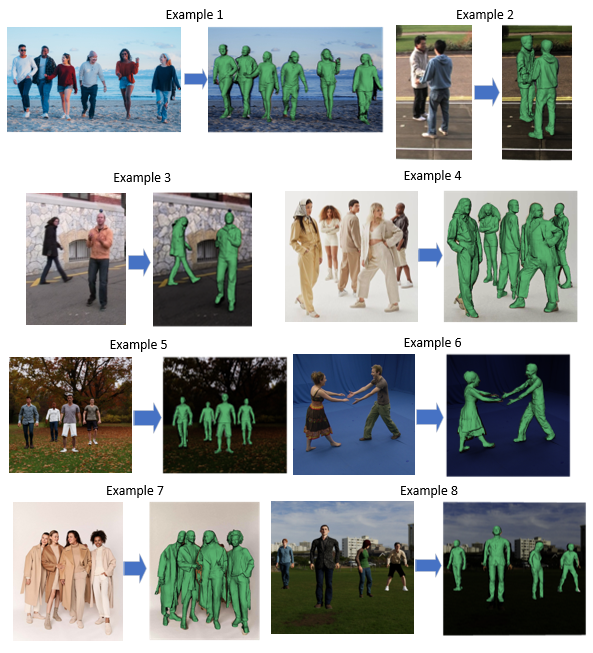

# Multiple Photorealistic Human 3D Reconstruction from Single Image
## Abstract
Reconstructing human pose and shape from a monocular view is a longstanding problem in the field of computer graphics. The goal is to reconstruct the 3D model of human body surface from an image or a video. Most existing monocular human reconstruction methods have achieved great progress which primarily focus on single-person reconstruction. However, research on multi-person reconstruction from a monocular perspective still face certain challenges. In this project, I present a novel learning framework capable of reconstructing multiple individuals with full details, including their clothing, faces, hair, and more, from a single image. For this method, I first employ a segmentation model to extract all elements from an input image. Then, I train a network to select the segmented images containing entire human figures. After image processing, I construct my own depth estimation network using UNet and ResNet to predict the depth information in the image, as it can be regarded as location in 3D space. Finally, I use an implicit function model for single-person reconstruction from a single image and position the individual 3D human models at the predicted locations in 3D space. The final results show great performance in my method.
## AbstractLiterature Review
Multi-Person 3D reconstruction in monocular view focus on recovering 3D human mesh from crowded scenes with monocular input. The core of multi-person reconstruction in monocular view lies in the accuracy of mapping the positional relationships of individuals in 2D input to 3D space, as well as the completeness of the models for each individual in the scene. Regarding the classification of methods, more commonly used criteria is based on design strategy which are categorized into two classes: the top-down strategy and the bottom-up strategy.

The top-down strategy initially employs target detection methods to decompose multi-person information in monocular input into individual information. Subsequently, the individual information is fed into the network for the prediction of single-person meshes. Finally, the single person results are combined to get reconstructed multi-person scene. Based on the top-down strategy, methods are capable of achieving relatively comprehensive reconstruction for individual persons. However, they tend to have lower accuracy in handling issues related to the positional information, occlusion and truncation of multiple individuals in the scene. 

The Bottom-up Strategy takes a holistic approach to handle multi-person information and achieve multi-person reconstruction. Method under this strategy feeds the entire monocular multi-person input into the network for simultaneous processing, allowing for a more comprehensive understanding of corresponding information such as positional occlusion between multiple individuals. However, due to the input being processed in a holistic manner rather than individual character information, the effectiveness in generating the detailed completeness of individual characters is significantly reduced.
.
## Methodology
In this project, a deep learning-based pipeline is developed for the photorealistic 3D reconstruction of multiple humans from a single image. The process begins with the application of the Segment Anything Model to extract all elements from the input image. Following this, a CNN is trained using the PASCAL VOC Dataset, employing a binary classification approach to identify and select the segmented images that contain entire human figures. Once the humans are detected, a depth estimation network is constructed utilizing UNet and an encoder based on ResNet34 to predict the depth information within the image. Using the previously segmented and selected single-person images, the depth and positional information of each individual is extracted from the estimated depth map, enabling them to be positioned within 3D space. An implicit function model is then employed for the reconstruction of single-person figures from the extracted human figures in the original image. Finally, these reconstructed photorealistic single-person models are positioned at the predicted 3D spatial coordinates. The workflow is illustrated below. .
## Result
The results of the proposed method demonstrate its effectiveness in reconstructing 3D spatial positions and photorealistic human meshes from a single input image. The primary achievements include 3D spatial localization of multiple individuals and high-fidelity reconstruction of human meshes with detailed attributes such as clothing, facial features, and hair. The test example results are shown below. .
## Conclusion
In conclusion, in this project, I first reviewed the development history of single-person reconstruction from a single image and introduced existing methods for multi-person reconstruction. Based on this, I proposed a novel deep learning network that differs from previous multi-person reconstruction methods by focusing on reconstructing multiple individuals with complete details from a single image, including their clothing, faces, hair, and more. The process includes initial segmentation, 3D location prediction based on depth estimation, single-person implicit photorealistic reconstruction, and finally, multi-person scene completion. These steps constitute the workflow of my method, which has shown promising results. 

Additionally, I explored and analyzed ways to address the challenges posed by occlusion, identifying potential improvements for the future. I plan to continue refining this work based on my analysis, aiming to enhance the model's effectiveness and efficiency in my future studies.
